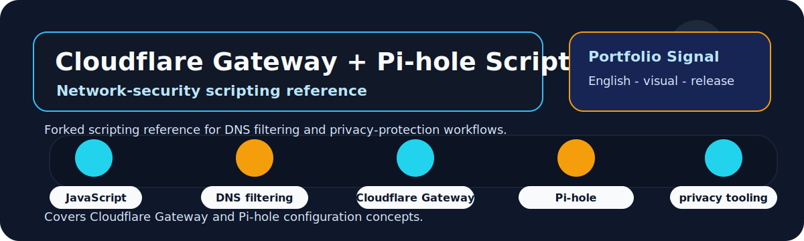

# Cloudflare Gateway and Pi-hole Script Fork Reference

  
  
  

  

## Overview

This fork is retained as a study reference for Cloudflare Gateway DNS/VPN scripting, ad-blocking lists, malware-domain filtering and tracking protection.

| Field | Details |
|---|---|
| Repository | [cloudflare-gateway-pihole-scripts](https://github.com/lhlizdabezt/cloudflare-gateway-pihole-scripts) |
| Portfolio category | Forked network-security scripting reference |
| Primary stack | JavaScript, DNS filtering, Cloudflare Gateway, Pi-hole concepts, network security, privacy tooling. |
| Latest release | [GitHub Releases](https://github.com/lhlizdabezt/cloudflare-gateway-pihole-scripts/releases/latest) |
| Tags | [Version tags](https://github.com/lhlizdabezt/cloudflare-gateway-pihole-scripts/tags) |
| Owner profile | [Luong Hai Long](https://github.com/lhlizdabezt) |

## Reviewer Map

| What to Review | Where to Look | Why It Matters |
|---|---|---|
| Technical scope | This README and source tree | Gives a quick, bounded reading path before opening every file |
| Evidence assets | Release page and top-level project files | Shows what can be downloaded or inspected quickly |
| Implementation material | Source folders, scripts, notebooks or design files | Connects the portfolio claim to real project artifacts |
| Version history | Tags and release notes | Makes the repository easier to audit over time |

## Evidence Highlights

- DNS and network-security scripting reference.
- Cloudflare Gateway and Pi-hole related configuration study.
- Ad-blocking, malware-domain and tracking-protection context.
- Kept as forked material, not original upstream authorship.

## Repository Structure

| Path | Purpose |
|---|---|
| `.devcontainer/` | Top-level directory included in the repository |
| `lib/` | Top-level directory included in the repository |
| `.editorconfig` | Top-level file included in the repository |
| `.env.example` | Top-level file included in the repository |
| `.node-version` | Top-level file included in the repository |
| `auto_update_github_action.yml` | Top-level file included in the repository |
| `cf_gateway_rule_create.js` | Top-level file included in the repository |
| `cf_gateway_rule_delete.js` | Top-level file included in the repository |

## Scope and Boundaries

Fork reference for personal study. It is not presented as a maintained security product.

## Role and Portfolio Context

Luong Hai Long keeps this fork as networking and security-configuration reference material.

## Release and Tagging Notes

This repository is maintained as part of an English-facing engineering portfolio. Releases and tags are used to preserve reviewable snapshots of the project, including source state, documentation updates and any available visual or report assets.

## Writing Standard

The README follows an evidence-first style: direct technical nouns, clear project boundaries, release-backed artifacts and no inflated claims beyond what the repository can support.
